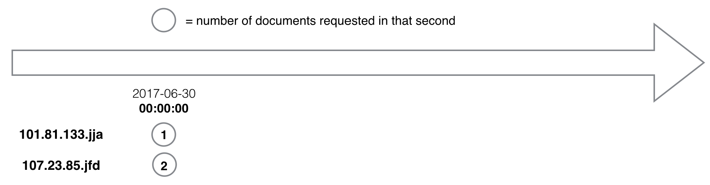
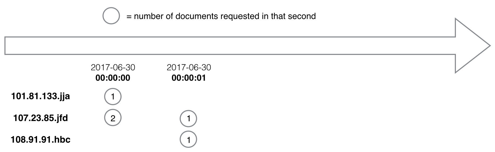
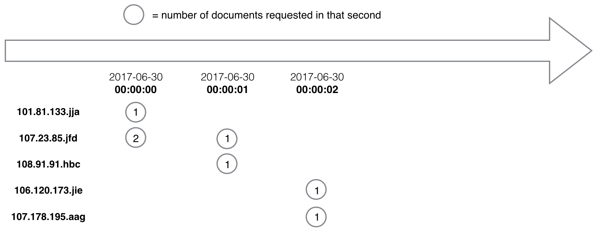
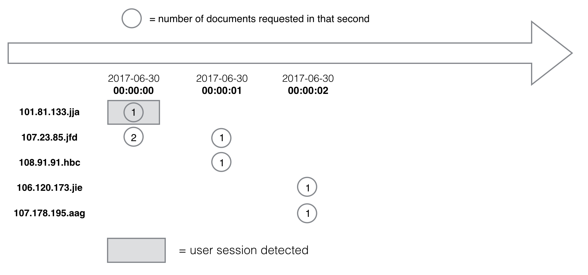
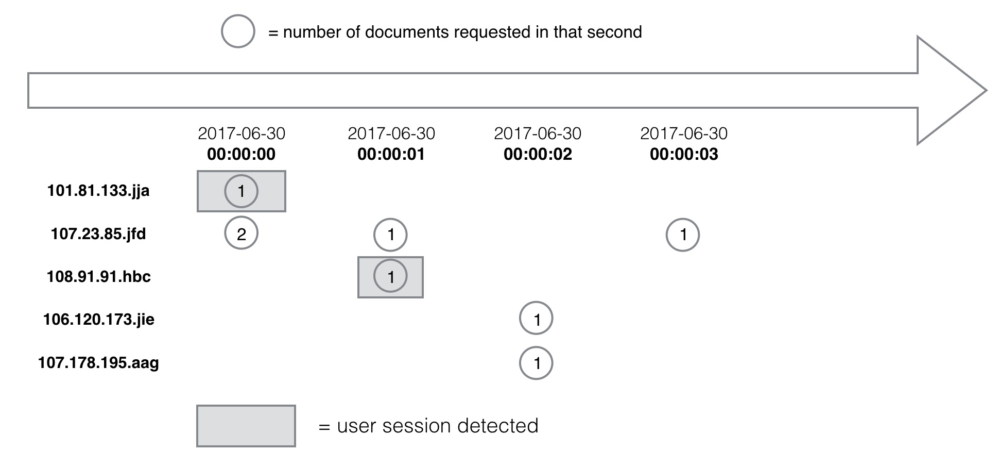

<!--
# Table of Contents
1. [Introduction](README.md#introduction)
2. [Challenge summary](README.md#challenge-summary)
3. [Example](README.md#example)

# Introduction
 the work flow:
 (1) read in log line by line and split into ip,date,time,cik,accession
     extension.
 (2) if ip not in ip_map=> create a doubly linked node in ip_list, which
     contains data(ip,ts,te,dt,nfiles),*prev,*next, which
     also returns a pointer *node (to itself) to ip_map to create {ip:*node}
     key-value pair in the map.

     if ip is in ip_map=> retrieve the node contains the ip data with current
     *node pointer, update the data ts,te,dt,nfiles, place the ip as a new
     node appended at the end of the list, remove the existing ip node, and
     rejoin the prev and next node together.

  (3) check the time for harvesting the session. if current time t+t_inactive
      then the linked list nodes which possess te<=t could be print out and
      removed. during output, sorted the ip's according to ts.

  data structures:
  typedef Node { *node, *prev,*next,ts,te,dt,nfiles};
  list<Node> ip_list; use ip_list.push_back(node) to insert new node to the end
  typedef std::unordered_map <std::string,*Node> ip_map

Many investors, researchers, journalists and others use the Securities and Exchange Commission's Electronic Data Gathering, Analysis and Retrieval (EDGAR) system to retrieve financial documents, whether they are doing a deep dive into a particular company's financials or learning new information that a company has revealed through their filings. 

The SEC maintains EDGAR weblogs showing which IP addresses have accessed which documents for what company, and at what day and time this occurred.

Imagine the SEC has asked you to take the data and produce a dashboard that would provide a real-time view into how users are accessing EDGAR, including how long they stay and the number of documents they access during the visit.

While the SEC usually makes its EDGAR weblogs publicly available after a six month delay, imagine that for this challenge, the government entity has promised it would stream the data into your program in real-time and with no delay.

Your job as a data engineer is to build a pipeline to ingest that stream of data and calculate how long a particular user spends on EDGAR during a visit and how many documents that user requests during the session. 

# Example

Suppose your input files contained only the following few lines. Note that the fields we are interested in are in **bold** below but will not be like that in the input file. There's also an extra newline between records below, but the input file won't have that.

**`inactivity_period.txt`**
> **2**

**`log.csv`**

>**ip,date,time**,zone,**cik,accession,extention**,code,size,idx,norefer,noagent,find,crawler,browser

>**101.81.133.jja,2017-06-30,00:00:00**,0.0,**1608552.0,0001047469-17-004337,-index.htm**,200.0,80251.0,1.0,0.0,0.0,9.0,0.0,

>**107.23.85.jfd,2017-06-30,00:00:00**,0.0,**1027281.0,0000898430-02-001167,-index.htm**,200.0,2825.0,1.0,0.0,0.0,10.0,0.0,

>**107.23.85.jfd,2017-06-30,00:00:00**,0.0,**1136894.0,0000905148-07-003827,-index.htm**,200.0,3021.0,1.0,0.0,0.0,10.0,0.0,

>**107.23.85.jfd,2017-06-30,00:00:01**,0.0,**841535.0,0000841535-98-000002,-index.html**,200.0,2699.0,1.0,0.0,0.0,10.0,0.0,

>**108.91.91.hbc,2017-06-30,00:00:01**,0.0,**1295391.0,0001209784-17-000052,.txt**,200.0,19884.0,0.0,0.0,0.0,10.0,0.0,

>**106.120.173.jie,2017-06-30,00:00:02**,0.0,**1470683.0,0001144204-14-046448,v385454_20fa.htm**,301.0,663.0,0.0,0.0,0.0,10.0,0.0,

>**107.178.195.aag,2017-06-30,00:00:02**,0.0,**1068124.0,0000350001-15-000854,-xbrl.zip**,404.0,784.0,0.0,0.0,0.0,10.0,1.0,

>**107.23.85.jfd,2017-06-30,00:00:03**,0.0,**842814.0,0000842814-98-000001,-index.html**,200.0,2690.0,1.0,0.0,0.0,10.0,0.0,

>**107.178.195.aag,2017-06-30,00:00:04**,0.0,**1068124.0,0000350001-15-000731,-xbrl.zip**,404.0,784.0,0.0,0.0,0.0,10.0,1.0,

>**108.91.91.hbc,2017-06-30,00:00:04**,0.0,**1618174.0,0001140361-17-026711,.txt**,301.0,674.0,0.0,0.0,0.0,10.0,0.0,

The single line on `inactivity_period.txt` tells us that once two seconds have elapsed since a user made a document request, we can assume that user's particular visit has ended. Any subsequent requests would be considered a new session.

The first day and time listed in the input file is 2017-06-30 and the time is 00:00:00. That means at that date and time, the following ip addresses initiated a visit to EDGAR:

* **101.81.133.jja** made a request for cik: **1608552.0**, accession: **0001047469-17-004337** and extention: **-index.htm**
* **107.23.85.jfd** made a request for cik: **1027281.0**, accession: **0000898430-02-001167** and extention: **-index.htm**
* **107.23.85.jfd** made a request for cik: **1136894.0**, accession: **0000905148-07-003827** and extention: **-index.htm**

So for the first second of data that your program has encountered, it knows one user has accessed one document and a second user has requested two:

When your program reads in the input file's fourth line, it should detect that the day and time has advanced by one second. So now, this is what we know:

Then when it reaches the sixth and seventh line:

When it first reads the eighth line, it should detect that the time is now `2017-06-30 00:00:03`. For one user, `101.8.33.jja`, its session has ended because two seconds of inactivity have passed for that user. Because there was only one request, only one web page document was accessed. 

At that point, the output file `sessionization.txt` should contain the following line:

    101.81.133.jja,2017-06-30 00:00:00,2017-06-30 00:00:00,1,1

After processing the eighth line of the input file and as we examine the timestamp in the ninth line of the input file, we detect that the time has progressed to `2017-06-30 00:00:04`. For a second user, `108.91.91.hbc`, we now see that two seconds of inactivity has elapsed and we can identify a second session:

The output file `sessionization.txt` should now consist of the following data:

    101.81.133.jja,2017-06-30 00:00:00,2017-06-30 00:00:00,1,1
    108.91.91.hbc,2017-06-30 00:00:01,2017-06-30 00:00:01,1,1

Finally, after your program processes the ninth and 10th line, it should detect that the end of file has been reached and there are no more requests for any users. At this point, it should identify all sessions regardless of the period of inactivity:

At that point, it should write the results to the output file, and the entire content of `sessionization.txt` should be:

    101.81.133.jja,2017-06-30 00:00:00,2017-06-30 00:00:00,1,1
    108.91.91.hbc,2017-06-30 00:00:01,2017-06-30 00:00:01,1,1
    107.23.85.jfd,2017-06-30 00:00:00,2017-06-30 00:00:03,4,4
    106.120.173.jie,2017-06-30 00:00:02,2017-06-30 00:00:02,1,1
    107.178.195.aag,2017-06-30 00:00:02,2017-06-30 00:00:04,3,2
    108.91.91.hbc,2017-06-30 00:00:04,2017-06-30 00:00:04,1,1

Notice from the above output that the first two lines were the ones we had already written. 

The third line details the session for `107.23.85.jfd` next because its first document request came at `2017-06-30 00:00:00`, which is earlier than any of the other remaining sessions. 

The fourth line belongs to IP address, `106.120.173.jie` because that user's first document request came at `2017-06-30 00:00:02`. The first document request from `107.178.195.aag` also comes at the same time but it is listed after `106.120.173.jie` in the input file so that is why it is listed on the fifth line.

The second session detected for `108.91.91.hbc` concludes the `sessionization.txt` file.

