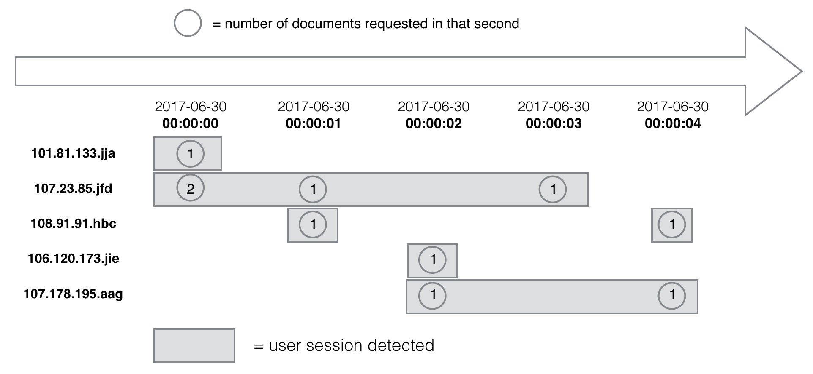
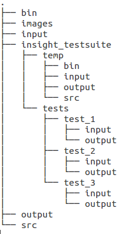

# Table of Contents
1. [Introduction](README.md#introduction)
2. [Data](README.md#data)
3. [Methods](README.md#methods)
4. [Usage](README.md#usage)
5. [Dependence](README.md#dependence)
6. [Directory](README.md#directory)


# Introduction

Sessionization, or session identification, refers to the process to identify a 
collection of continuous requests to one website from a user, also known as a 
session, based on the data save by web server, e.g., a web log. 
This sessionization process allows one to study users's trends and usage patterns 
and help develop successful business strategy. 

This pipeline provides a simple, fast, and scalable way to identify sessions from large
scale web logs.  For example, it takes only 2 minutes on my laptop to identify more than 
$200,000$ sessions (assuming inactive period of 5 minutes) in a 2.6G log
[`log20170630.csv`](http://www.sec.gov/dera/data/Public-EDGAR-log-file-data/2017/Qtr2/log20170630.zip) (caution: large file!).

The pipeline therefore allows a real-time analysis of how users are accessing a website, including how long they stay 
and the number of documents they access during their visit, provided a real-time data streaming service. 

# Data
`log20170630` is one of [web logs](https://www.sec.gov/dera/data/edgar-log-file-data-set.html)
of The Electronic Data Gathering, Analysis and Retrieval (EDGAR) system maintained by 
the Securities and Exchange Commission (SEC). We also construct manually small sized csv files 
in a similiar format to test the code.


# Methods 

## Definition of a session
A single user session is defined to have started when the IP address first requests a document from the EDGAR system and 
continues as long as the same user continues to make requests. The session is over after a certain period of inactive time. 
An exmaple of sessionization can be illustrated as below:


The identified sessions would read like given an inactive time limit of 2 seconds.

    101.81.133.jja,2017-06-30 00:00:00,2017-06-30 00:00:00,1,1
    108.91.91.hbc,2017-06-30 00:00:01,2017-06-30 00:00:01,1,1
    107.23.85.jfd,2017-06-30 00:00:00,2017-06-30 00:00:03,4,4
    106.120.173.jie,2017-06-30 00:00:02,2017-06-30 00:00:02,1,1
    107.178.195.aag,2017-06-30 00:00:02,2017-06-30 00:00:04,3,2
    108.91.91.hbc,2017-06-30 00:00:04,2017-06-30 00:00:04,1,1


## Data structure
We use a double linked list to store pending sessions, each element in list is a session pointer. Doubly linked list provides us 
an efficient way to append and remove individual session to keep the process working in real time.  We use an unordered map to 
store the key-value pair `<session_ip, list_iterator>`, with the iterator points to list element associated with `session_ip`. 
This way we can quickly update pending sessions without the need of inefficient lookup in the list. 

## Work flow
1. For each new event retrieved from the log, we use its timestamp to pop up expired sessions from the existing list (empty for 
the first event), given a fixed inactive period. These sessions are then printed out and erased from the list and the map. 

2. We then integrate this new event into a session in the list as below:
  * case 1: there is pending session in list with the new event ip. We update that session's end timestamp and page count, and move it to the end of the list. 
  
  * case 2: there is no pending session in list with this new event ip. We create a new session with given event properties and push it to the end of the session list.
  
3. We update the map to keep track of the iterator of this pending session. 

4. We start to process the next event in the log and go back to step 1. In case there is no more incoming event, e.g., reaching the end-of-file, we print the pending sessions out.

## Efficacy

* Easy to identify expired sessions: sessions in list are sorted by its end timestamp with above implementation, that’s why we can easily print out expired sessions (from the front) for any specified timestamp.

* Memory-efficient: List stores pending sessions but not expired sessions, and only one session per user ip.
 
* Dynamical processing:  the map gives us an easy way to access any list element and apply erase operation on it.
u 
* Handling edge cases: A sorting function is applied on a set of expired sessions when printing out, so that we can handle the edge case when last update time is the same.


# Usage
On top level of the package, execute 
```bash
./run.sh 
```
to compile and run the pipeline. By default, the executable is being stored in `./bin`, input (log.csv) and parameter(e.g., inactivity_period.txt) files are under `./input`, and the generated sessions (sessionization.csv) are stored in `./output` directory.

It is easy to change this script to process different input files. In `run.sh`, you could specify different input, parameter, and output files:
```bash
./bin/./SGenerator -i ./input/your_input_file . -p ./input/your_param_file -o ./output/your_output_file
```

# Dependence 
- c++ 11
- make

# Directory


